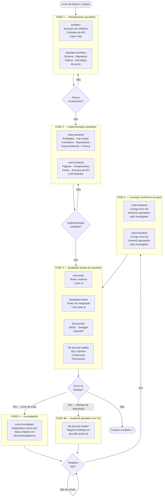

# Fluxo de Agentes para Projetos de Grande Escala

Este documento descreve como coordenar todos os agentes disponíveis neste
repositório em um projeto completo — desde o planejamento da arquitetura até
a correção de erros e auditoria de segurança.

---

## Fluxograma



---

## As cinco fases explicadas

### Fase 1 — Planejamento

Os dois agentes de planejamento rodam **em paralelo** — produzem artefatos
independentes (documentos em `docs/architecture/`). A única restrição é que
o `architect` define os nomes das entidades do domínio, que o `database-architect`
usa para nomear tabelas. Se o domínio não estiver claro, rode o `architect`
primeiro e o `database-architect` depois.

| Agente | O que entrega |
|---|---|
| `architect` | Layer map, contratos de API (tipos de request/response), diagrama de dependências, plano salvo em `docs/architecture/` |
| `database-architect` | Schema Prisma, migrations, índices, plano salvo em `docs/architecture/` |

**Gate de saída:** leia os dois planos e valide que os contratos são coerentes
(nomes de entidades batem, tipos de API estão definidos). Somente então avance.

___

### Fase 2 — Implementação

Com os contratos definidos, `node-backend` e `react-frontend` rodam **em
paralelo** — cada um trabalha em seu próprio domínio de arquivos sem risco
de conflito.

| Agente | O que precisa receber no prompt | O que entrega |
|---|---|---|
| `node-backend` | Plano do `architect` + schema do `database-architect` + escopo da feature | Entidades, use cases, controllers, repositories |
| `react-frontend` | Contratos de API do `architect` + escopo das telas | Páginas, componentes, hooks, serviços de API, CSS Modules |

**Gate de saída:** a implementação deve estar completa antes de testar. Testes
em código incompleto geram ruído.

___

### Fase 3 — Qualidade

Quatro agentes em paralelo total — cada um escreve em um tipo diferente de
arquivo, sem possibilidade de conflito:

| Agente | Destino dos arquivos |
|---|---|
| `unit-tester` | `*.spec.ts` — novos arquivos de teste unitário |
| `integration-tester` | `*.e2e-spec.ts` — novos arquivos de teste de integração |
| `documenter` | Arquivos de produção existentes — adiciona JSDoc/Swagger |
| `db-security-auditor` | `docs/db-audit.md` — relatório de auditoria |

**Gate de saída:** leia os resultados. Se todos os testes passam e não há
findings críticos de segurança → feature completa. Caso contrário, avance
para a Fase 4.

___

### Fase 4 — Investigação

`error-investigator` e `db-security-auditor` podem rodar **em paralelo** se
houver tanto erros de teste quanto findings de segurança simultâneos. Ambos
são somente leitura — não alteram código.

| Agente | O que recebe | O que entrega |
|---|---|---|
| `error-investigator` | Mensagens de erro dos testes, stack traces | Relatório com causa raiz por falha em `docs/investigations/` |
| `db-security-auditor` | Código do repositório | Findings atualizados em `docs/db-audit.md` |

**Gate de saída obrigatório:** leia o relatório do `error-investigator` antes
de despachar qualquer correção. Corrigir sem entender a causa raiz gera
retrabalho em loop.

___

### Fase 5 — Correção

Com o relatório em mãos, identifique se os erros são de backend, frontend ou
ambos. Se forem de domínios diferentes, despache `node-backend` e
`react-frontend` **em paralelo** — cada um recebe o trecho relevante do
relatório.

Após a correção, **volte à Fase 3** para revalidar. Repita até o gate de
qualidade passar.

___

## Regras de paralelismo

### Sempre seguro — rodar junto sem verificação

```
error-investigator  +  db-security-auditor
error-investigator  +  documenter
error-investigator  +  unit-tester
error-investigator  +  integration-tester
db-security-auditor +  documenter
db-security-auditor +  unit-tester
db-security-auditor +  integration-tester
documenter          +  unit-tester
documenter          +  integration-tester
unit-tester         +  integration-tester
```

Qualquer combinação desses agentes é segura: escrevem em arquivos de natureza
diferente ou apenas em `docs/`.

### Condicionalmente seguro — verificar antes

```
architect          +  database-architect   → seguro se o domínio estiver definido
node-backend       +  react-frontend       → seguro se os contratos de API estiverem definidos
node-backend (A)   +  node-backend (B)     → seguro se escrevem em módulos diferentes
react-frontend (A) +  react-frontend (B)   → seguro se escrevem em páginas/componentes diferentes
```

### Nunca em paralelo — dependência obrigatória

```
architect        →  node-backend       (plano deve existir antes da implementação)
architect        →  react-frontend     (contratos de API devem existir antes)
database-architect → node-backend      (schema deve existir antes dos repositories)
error-investigator → node-backend      (relatório deve ser lido antes de corrigir)
error-investigator → react-frontend    (relatório deve ser lido antes de corrigir)
```

___

## Catálogo de agentes

| Agente | Papel | Escreve código de produção? | Destino | Modelo |
|---|---|---|---|---|
| `architect` | Design de módulos, contratos, layer map | Não | `docs/architecture/` | Sonnet+ |
| `database-architect` | Schema, migrations, índices | Migrations | `docs/architecture/` + `prisma/` | Sonnet+ |
| `node-backend` | Entidades, use cases, controllers, repositories | **Sim** | `src/` (backend) | Sonnet+ |
| `react-frontend` | Componentes, páginas, hooks, serviços, CSS | **Sim** | `src/` (frontend) | Sonnet+ |
| `unit-tester` | Testes unitários com mocks | Arquivos de teste | `*.spec.ts` | Haiku¹ |
| `integration-tester` | Testes de integração com infra real | Arquivos de teste | `*.e2e-spec.ts` | Sonnet+ |
| `documenter` | JSDoc, Swagger/OpenAPI, comentários inline | Só documentação | Arquivos de produção existentes | Haiku |
| `db-security-auditor` | Auditoria de queries, credenciais, permissões | Não | `docs/db-audit.md` | Sonnet+ |
| `error-investigator` | Diagnóstico de falhas, causa raiz | Não | `docs/investigations/` | Sonnet+ |

> ¹ `unit-tester` usa Haiku por padrão. Para módulos com lógica de domínio complexa,
> sobrescreva na chamada: `Agent(unit-tester, model: sonnet)`.

### Por que esses dois usam Haiku

**`documenter`** — tarefa mecânica e altamente repetitiva: lê assinatura de função,
escreve descrição, repete. O output é fácil de revisar e corrigir se necessário.
Risco baixo, volume alto.

**`unit-tester`** — para a maioria dos casos (funções puras, CRUD, validações)
o padrão é previsível: identificar entradas/saídas, escrever `expect`. Módulos
com regras de negócio complexas ou múltiplos estados podem precisar de Sonnet.

___

## Exemplo de despacho por fase

### Fase 1

```
Agent(architect) →
  "Planeja o módulo de pedidos (orders). Stack: NestJS + Prisma.
   Defina: estrutura de camadas, contratos de API (request/response types),
   interfaces de repositório. Salve em docs/architecture/.
   NÃO escreva código de produção."

Agent(database-architect) →
  "Planeja o schema do módulo de pedidos. Entidades esperadas: Order, OrderItem,
   Payment. Defina tabelas, relacionamentos, índices e migrations.
   NÃO escreva código de aplicação."
```

### Fase 2 (após ler os planos)

```
Agent(node-backend) →
  "Implementa o módulo de pedidos conforme docs/architecture/001-orders.md.
   Stack: NestJS + Prisma. Siga Clean Architecture / Hexagonal.
   Schema já está em prisma/schema.prisma."

Agent(react-frontend) →
  "Implementa a tela de checkout conforme contratos de API em
   docs/architecture/001-orders.md. Stack: React + Vite + CSS Modules.
   Endpoint: POST /orders — tipos definidos no plano."
```

### Fase 3

```
Agent(unit-tester)        → "Escreve testes unitários para order.use-case.ts"
Agent(integration-tester) → "Escreve testes de integração do fluxo de criação de pedido"
Agent(documenter)         → "Documenta endpoints de /orders com Swagger/OpenAPI"
Agent(db-security-auditor)→ "Audita queries e credenciais do módulo de pedidos"
```

### Fase 4 (se testes falharam)

```
Agent(error-investigator) →
  "Investiga as 2 falhas em order.use-case.spec.ts:
   1. 'should reject order with empty items' — passa quando deveria falhar
   2. 'should calculate total correctly' — retorna 0 em vez do valor esperado
   NÃO altere código. Retorne causa raiz e recomendação."
```

### Fase 5 (após ler o relatório)

```
Agent(node-backend) →
  "Corrige as falhas apontadas em docs/investigations/order-use-case.md.
   Causa raiz 1: validação de items vazia não está sendo feita no use case.
   Causa raiz 2: método calculateTotal não soma corretamente items com desconto."
```
